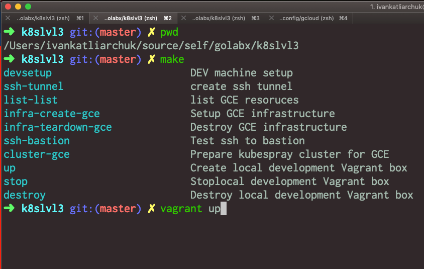
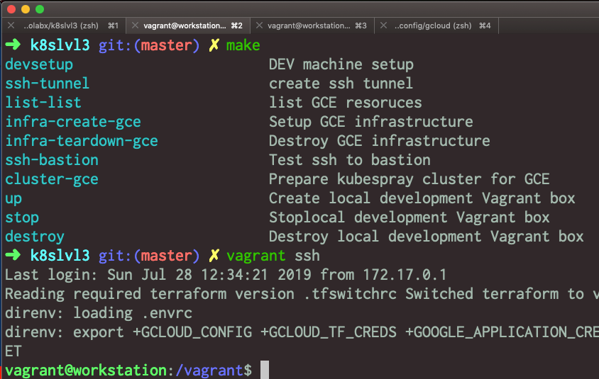
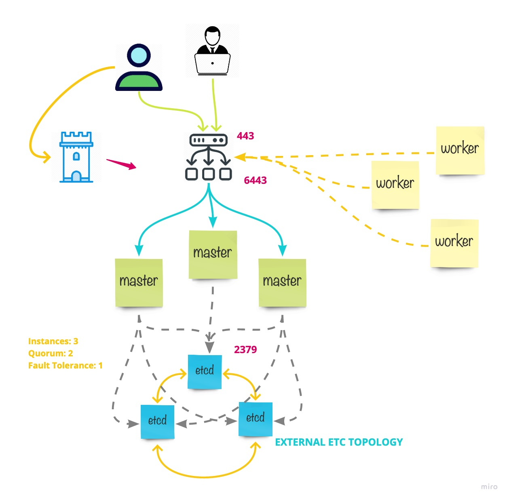

# Kuberentes at Master

<!-- START makefile-doc -->
```
$ make help 
devsetup                       DEV machine setup
ssh-tunnel                     create ssh tunnel
list-gce                       list GCE resoruces
infra-create-gce               Task '2.1' > Setup GCE infrastructure for K8s cluster
infra-create-aws               Task '2.1' > Setup AWS infrastructure for K8s cluster
ssh-test                       Test ssh connection
aws                            Task '2.1' > Setup AWS infrastructure for K8s cluster
aws-cluster                    Task '2.2' > provision cluster on AWS
aws-cluster-provision          Task 3.1, 4.2,5.1,6.1,8.1,10.1,11: Provision cluster resources
aws-destroy                    Task '13' > reset current cluster and destroy infrastructure
dashboard-show                 Task '10' > Show dashboard with Access Token
cicd-show                      Task '3' > Show CI/CD dashboard
infra-teardown-gce             Task '13' > Tear down cluster with GCE infrastructure
ssh-jump                       Jump to any instance in network
up                             Create local development Vagrant box
stop                           Stoplocal development Vagrant box
destroy                        Destroy local development Vagrant box
validate                       Validate pre commit 
```
<!-- END makefile-doc -->

## Prerequisits

- [Docker (Optinal&Experimental setup)](https://www.docker.com/why-docker)
- [Vagrant](https://www.vagrantup.com/)
- [VirtualBox](https://www.virtualbox.org/wiki/Downloads)

## Project structure / Directory Layour

	.
	├── bin                         # scripts required to provision workspace & infrastructure
	├── data                        # store terraform parameters, ssh keys, kubeconf file
	├── images                      # images used in readme & docs
	├── kubespray                   # [kubespray](https://github.com/kubernetes-sigs/kubespray) project as submodule, forked from
	├── templates                   # templates used to create Vagrant box as well as provision infrastructure
	├── terraform                   # infrastructure-as-code terraform sources
		- cluster                     # cluster provisioning
		- gce                         # google cloud vendor related sources
		-- infrastructure
		- modules                     # infrastructure-as-code modules
		-- gce
		-- k8s
	─── .etidortconfig              # [project formatter](https://editorconfig.org/)
	─── .envrc                      # (load/unload](https://direnv.net/) project specific environment variables
	─── .pre-commit-config.yaml     # [framework](https://github.com/pre-commit/pre-commit-hooks) for manaing multi-language pre-commit hooks
	─── .tfswitchrc                 # [terraform version switcher](https://warrensbox.github.io/terraform-switcher/)
	─── Brewfile                    # [framework](https://docs.brew.sh/Homebrew-on-Linux) that help to install dependencies for current project
	─── Makefile                    # tells project what to do
	─── Vagrantfile                 # [describe](https://www.vagrantup.com/docs/vagrantfile/) what type of machine to build
	└── README.md                   # current file

All dependencies except docker & vagrant installed automatically on dev workspace.

## Setup Development Workspace

In root project folder, provision development environment with all the dependencies



SSH to the box so we can deploy cluster&provision infrastructure



```
vagrant up
vagrant provision
vagrant ssh
```

### Setup AWS credentials

set environment variables to work with AWS CLI
```
export AWS_ACCESS_KEY_ID=XXXXXXXXXX
export AWS_SECRET_ACCESS_KEY=XXXXXXXXXX
```

### Setup Google Credentials

The workspace should have all the dependencies. There is one gotcha. Google cloud require authentication.
So at the mean time there is an explicit copy from users `~/.config/glcou` folder.

All required environment variables provided in `.envrc` folder. As well as terraform version is set in
`.tfswitchrc` folder. All plus optional dependencies are set via `Brewfile`. Supported operation versions are
Linux & MacOS. `Vagrantfile` support `Docker` as well as `Oracle VM (classic)` workspace provisioning.

## Cluster Architecture




## Create a new infrastructure environment

## Helm & Tiller deployment diagram

## Dashboard

manual
https://www.replex.io/blog/how-to-install-access-and-add-heapster-metrics-to-the-kubernetes-dashboard
terraform

TODO: validate token is read only
http://blog.cowger.us/2018/07/03/a-read-only-kubernetes-dashboard.html
explain howe created view only dashboard token


## Istio install

https://github.com/istio/istio/tree/master/install/kubernetes/helm/istio
https://istio.io/docs/setup/kubernetes/install/helm/
```
$ echo -n 'admin' | base64
YWRtaW4=
$ echo -n '1f2d1e2e67df' | base64
MWYyZDFlMmU2N2Rm
$ cat <<EOF | kubectl apply -f -
apiVersion: v1
kind: Secret
metadata:
  name: kiali
  namespace: $NAMESPACE
  labels:
    app: kiali
type: Opaque
data:
  username: YWRtaW4=
  passphrase: MWYyZDFlMmU2N2Rm
EOF
```

## Kubernetes checklist
https://www.replex.io/kubernetes-production-readiness-and-best-practices-checklist?hsCtaTracking=52c459a8-6841-49da-9b79-67355ea6f632%7C1e51607c-2f30-40af-ae29-fd5adfe33636